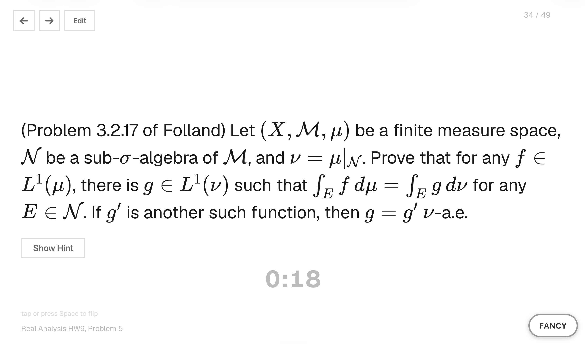

<div align="center">


# Chalk

### Find what you don't know yet — then drill it until you do.

A local-first flashcard app for **graduate qualifying and preliminary exams in math**.
Rate your confidence; Chalk keeps surfacing your weakest cards until they aren't weak anymore.

<br/>


</div>

---

Most flashcard apps treat every card the same. Chalk tracks how confident you are on each one and sends you
straight to your weak spots — while keeping a digital record of the work you do on **paper or a blackboard.**

> **Why it exists.** I built Chalk to get through my graduate **math preliminary exam** — hundreds of
> proof-based problems where the only way through is knowing which ones you *can't* yet do. Re-reading proofs
> you've mastered feels productive and changes nothing; Chalk drags you back to the ones you'd avoid.

<div align="center">



</div>

---

## ◇ Why Chalk

### 🎯 &nbsp;Confidence scoring that hunts your weak spots

Rate each card **0–10**. Chalk remembers every rating and uses it to decide what's next:

- **First pass** — every card once, shuffled, nothing skipped.
- **Review** — the deck re-sorts **lowest-confidence-first**, rebuilding after every rating so your weakest cards stay on top until they aren't.
- **Catalogue** — the whole deck with **red / yellow / green** badges and full history, sortable by *weakest first*.

Stop re-reading what you know. Start fixing what you don't.

### ✍️ &nbsp;Photograph your handwritten work

Snap a photo from your webcam or upload one — your worked solutions live right next to the problem in a
carousel with lightbox, zoom, and rotate. Think in ink, keep a clean digital record.

### ∑ &nbsp;Markdown + LaTeX, beautifully rendered

Problems and notes render real math with [KaTeX](https://katex.org/) — `$...$` inline, `$$...$$` display.
Write per-card notes in Markdown + LaTeX, typeset on the spot.

### 🔁 &nbsp;A study loop that remembers

See everything once, then drill weakest-first — automatically. Plus per-card timers, one-sentence hints, and a
**"Copy for Claude"** button that hands any problem to your AI tutor.

---

## ◇ Quick start

**macOS**, **Python 3** (already on every Mac), a browser. Nothing to install.

```bash
git clone https://github.com/Qile-J/chalk-flashcards.git
cd chalk-flashcards
python3 server.py
```

Open **http://localhost:8000** — or just double-click **`Start Chalk.command`**.

> Ships empty — hit **+ New course** to start, or drop in a ready-made deck (below).

---

## ◇ Add your own courses

A course is just data — **no code changes.** Add it from inside the app (**+ New course**, **+ Add Card**) or
edit the JSON directly:

```json
{
  "id": "probability",
  "number": 1,
  "statement": "Let $X_1, X_2, \\dots$ be i.i.d. with $\\mathbb{E}[X_1] = \\mu$. State and prove the WLLN.",
  "hint": "Truncate, bound the variance, then apply Chebyshev.",
  "tags": ["limit-theorems", "convergence"]
}
```

Full schema in [`CLAUDE.md`](CLAUDE.md) and [`CONTRIBUTING.md`](CONTRIBUTING.md).

---

## ◇ Contribute — bring your courses with you

**The best thing you can do for Chalk is share the deck you're studying.** Built a Real Analysis, Probability,
Algebra, Topology, or ML deck? **Open a PR** so the next student doesn't start from a blank page.

- 📚 **Add a course** — see [`CONTRIBUTING.md`](CONTRIBUTING.md) for the format.
- 🛠️ **Improve the app** — features and fixes welcome; keep it dependency-free.
- 💡 **Have an idea?** Open an issue.

> Share only what you have the right to — original or openly-licensed problems, not copyrighted solution
> manuals. Your progress and photos are gitignored, so they never end up in a PR.

---

## ◇ Built with

- **Vanilla JavaScript** — no framework, no bundler
- **Python standard library** — the whole server is one file, zero pip installs
- **[KaTeX](https://katex.org/)** — vendored locally for fast, offline math rendering
- **Your machine, only** — no account, no cloud, no telemetry

No `node_modules`. No build step. Clone it and run it.

---

<div align="center">

Built for everyone grinding through a math prelim — and anyone studying something genuinely hard. ◇

**[Get started](#-quick-start)** · **[Add a course](CONTRIBUTING.md)** · **[MIT License](LICENSE)**

</div>
